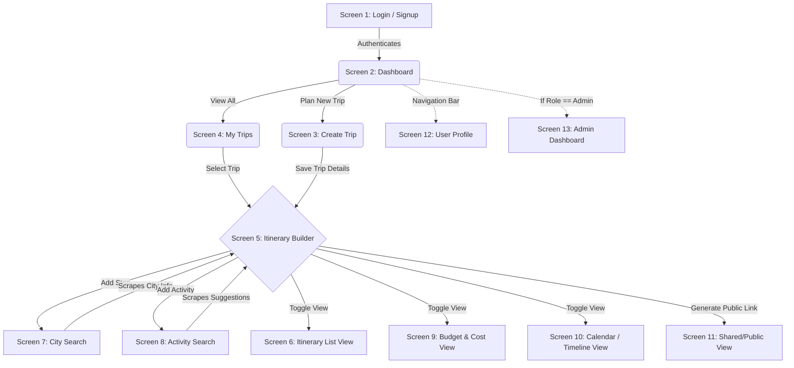
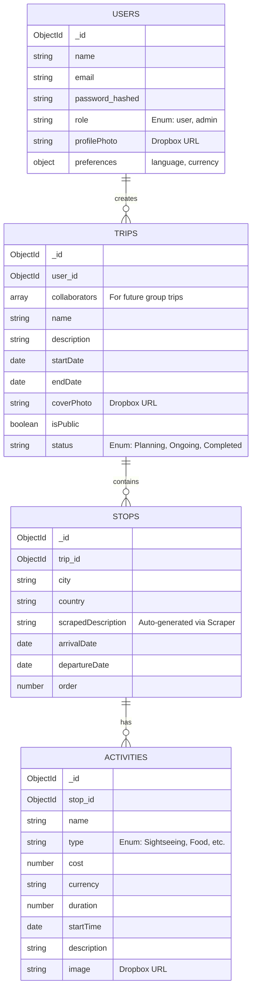

# GlobeTrotter System Architecture & Schema Design

This document serves as the master blueprint for the GlobeTrotter application, detailing the user flow, database schema, and technical architecture.

## 1. User Journey & Screen Flow

The following diagram illustrates how a user navigates through the GlobeTrotter application.

## 2. Database Schema (Entity-Relationship Diagram)

We use a normalized MongoDB schema to handle complex travel data, mimicking relational databases.

## 3. The Scraping Strategy (Node.js backend)

To provide "Cutting-Edge" features without expensive paid APIs, we utilize native Node.js scraping (`axios` + `cheerio`). 

*Note: We strictly use Dropbox URLs for user-uploaded images (cover photos, profile pictures) to ensure high reliability. Scraping is reserved for data enrichment.*

1. **City Intelligence (`/api/scrape/city-info`)**: When a user selects a city in the Itinerary Builder, the backend scrapes Wikipedia or Wikivoyage to instantly populate the stop's `scrapedDescription` and generic cost/safety indexes.
2. **Activity Discovery (`/api/scrape/activities`)**: If a user needs inspiration, the backend scrapes travel blogs to generate a dynamic list of "Top 5 things to do" in that specific city, which they can click to instantly add to their itinerary.

## 4. Admin Panel Architecture

The Admin dashboard (Screen 13) is built as a completely separate application to ensure security and clean code separation.

- **Frontend:** A standalone React/Vite application located in the `/admin` folder.
- **Backend Protection:** An `adminMiddleware.js` script on the Express server ensures that ONLY users with `role: 'admin'` in the database can access the `/api/admin/*` endpoints.
- **Functionality:** Manage users, view total platform statistics, and see the most popular scraped destinations.
