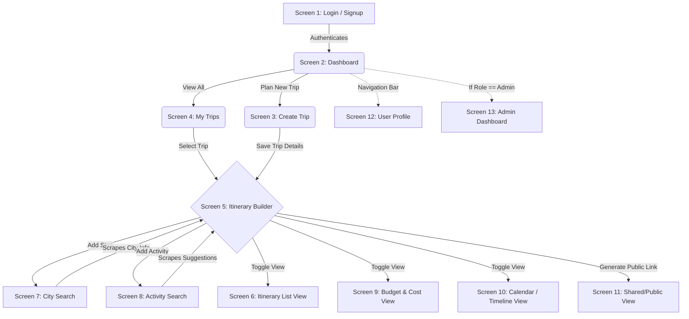
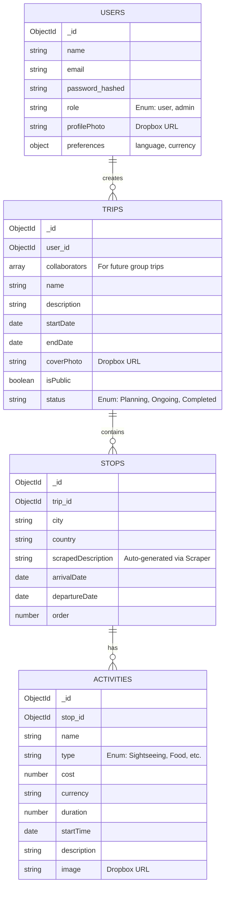

# GlobeTrotter System Architecture & Schema Design

This document serves as the master blueprint for the GlobeTrotter application, detailing the user flow, database schema, and technical architecture.

## 1. User Journey & Screen Flow

The following diagram illustrates how a user navigates through the GlobeTrotter application.



## 2. Database Schema (Entity-Relationship Diagram)

We use a normalized MongoDB schema to handle complex travel data, mimicking relational databases.



## 3. The Scraping Strategy (Node.js backend)

To provide "Cutting-Edge" features without expensive paid APIs, we utilize native Node.js scraping (`axios` + `cheerio`). 

*Note: We strictly use Dropbox URLs for user-uploaded images (cover photos, profile pictures) to ensure high reliability. Scraping is reserved for data enrichment.*

1. **City Intelligence (`/api/scrape/city-info`)**: When a user selects a city in the Itinerary Builder, the backend scrapes Wikipedia or Wikivoyage to instantly populate the stop's `scrapedDescription` and generic cost/safety indexes.
2. **Activity Discovery (`/api/scrape/activities`)**: If a user needs inspiration, the backend scrapes travel blogs to generate a dynamic list of "Top 5 things to do" in that specific city, which they can click to instantly add to their itinerary.

## 4. Admin Panel Architecture

The Admin dashboard (Screen 13) is built as a completely separate application to ensure security and clean code separation.

- **Frontend:** A standalone React/Vite application located in the `/admin` folder.
- **Backend Protection:** An `adminMiddleware.js` script on the Express server ensures that ONLY users with `role: 'admin'` in the database can access the `/api/admin/*` endpoints.
- **Functionality:** Manage users, view total platform statistics, and see the most popular scraped destinations.

## 5. Frontend Design System & UI Consistency Guide

To ensure **100% visual consistency** across all screens built by all 4 collaborators, adhere strictly to these design system tokens:

### A. Color Palette (Organic Pistachio, Sage & Cream)
- **Primary Buttons & Key Accents:** `bg-pistachio-700` (`#3f5e33`), hover: `bg-pistachio-800` (`#354c2b`), text: `text-white`
- **Secondary Accents / Badges:** `bg-pistachio-100` (`#e5ede0`), `text-pistachio-900` (`#2c3f25`), border: `border-pistachio-200`
- **Page Canvas Background:** `bg-[#fafaf7]` (Warm natural cream)
- **Cards & Modals:** `bg-white` with `border-pistachio-100` (`#e5ede0`) and `shadow-soft` (`0 4px 20px -2px rgba(63, 94, 51, 0.08)`)
- **Dark Hero / Navbar Accent:** `bg-pistachio-950` (`#152311`) and `bg-pistachio-900` (`#2c3f25`)

### B. Typography System
All 3 Google Fonts are pre-loaded in `index.html` and available via Tailwind classes:
1. **`font-script` (`Kaushan Script` / `Caveat`):** Used for expressive, organic cursive accent words (*Inspiration*, *Curated Escapes*, *Your Adventures*).
2. **`font-serif` (`Playfair Display`):** Used for luxury page titles, section headings (`h1`, `h2`, `h3`), and card titles.
3. **`font-sans` (`Plus Jakarta Sans`):** Default for body copy, form inputs, navigation items, buttons, and numbers.

### C. Standard Component Tokens
- **Primary Action Button:**
  ```jsx
  <button className="bg-pistachio-700 hover:bg-pistachio-800 text-white font-semibold px-5 py-2.5 rounded-xl shadow-soft hover:shadow-lifted transition-all">
    Button Text
  </button>
  ```
- **Form Input Field:**
  ```jsx
  <input className="w-full px-4 py-2.5 bg-white border border-pistachio-200 rounded-xl text-slate-800 placeholder-slate-400 focus:ring-2 focus:ring-pistachio-500 focus:border-pistachio-500 outline-none transition-all" />
  ```
- **Standard Container Card:**
  ```jsx
  <div className="bg-white rounded-2xl border border-pistachio-100 p-6 shadow-soft hover:shadow-lifted transition-all">
    {/* Card Content */}
  </div>
  ```

### D. Status & Category Badge Standards
- **Trip Statuses:**
  - `Planning`: `bg-pistachio-100 text-pistachio-900 border border-pistachio-200`
  - `Ongoing`: `bg-pistachio-700 text-white`
  - `Completed`: `bg-emerald-600 text-white`
- **Activity Categories:**
  - `Sightseeing`: `bg-purple-50 text-purple-700 border border-purple-200`
  - `Food`: `bg-rose-50 text-rose-700 border border-rose-200`
  - `Accommodation`: `bg-indigo-50 text-indigo-700 border border-indigo-200`
  - `Transport`: `bg-sky-50 text-sky-700 border border-sky-200`
  - `Other / Note`: `bg-pistachio-50 text-pistachio-800 border border-pistachio-200`
